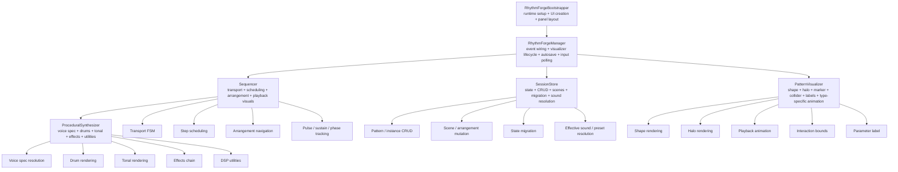
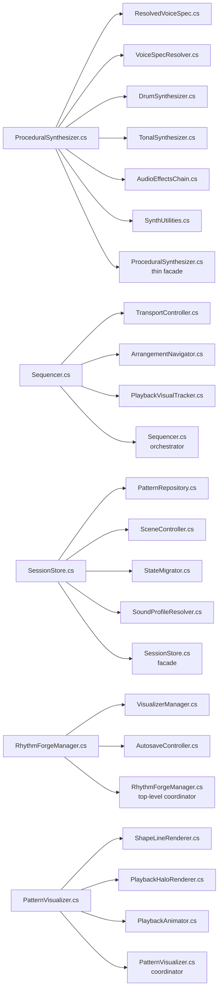
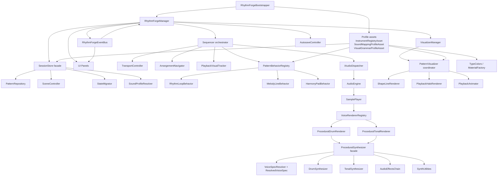
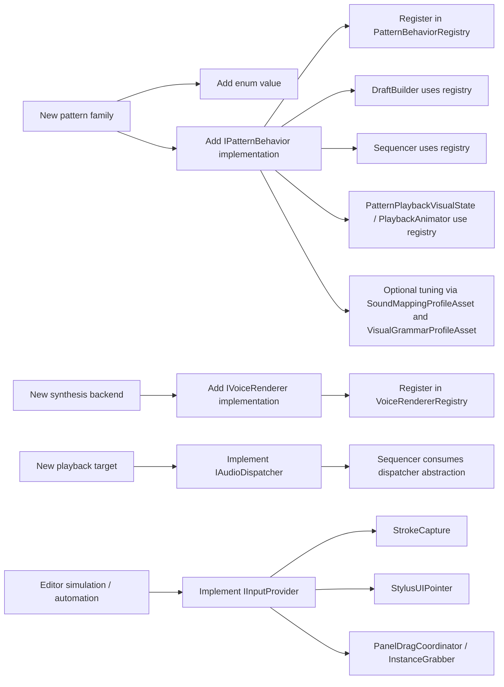

# RhythmForge VR Architecture Evolution

Companion to `Refactoring-Plan.md`.

This note summarizes:
- how responsibilities were concentrated in the original architecture,
- how they are distributed in the current refactored architecture,
- which extension points now exist,
- why the new structure is easier to extend, test, and maintain.

## 1. Initial Architecture: Responsibility Concentration

The original codebase centered a large amount of behavior in a few high-pressure classes. Each class mixed multiple unrelated responsibilities, which increased change surface and made new features expensive.

| Original class | Approx. size from plan | Initial responsibility mix |
|---|---:|---|
| `ProceduralSynthesizer.cs` | ~600+ lines | voice spec resolution, drum generation, tonal generation, effects, waveform/filter utilities |
| `Sequencer.cs` | ~580 lines | transport FSM, lookahead scheduling, arrangement navigation, playback visual tracking |
| `SessionStore.cs` | ~515 lines | app state, CRUD, scene mutation, state migration, sound resolution |
| `RhythmForgeManager.cs` | ~390 lines | lifecycle wiring, visualizer lifecycle, scene switching input, autosave, playback dispatch |
| `PatternVisualizer.cs` | ~440 lines | line rendering, playback halo, marker, collider, labels, per-pattern visual grammar |

### Initial structure

### Initial pain points

- Adding a new pattern type meant changing multiple places that switched on `PatternType`.
- Audio behavior and DSP logic were hard to test independently from the full rendering path.
- UI panels and manager wiring depended on direct callback chains.
- Sound and visual formulas were embedded in code instead of being tunable in data.

## 2. Evolution Map: Old Large Classes to New Focused Units

## 3. Current Refactored Architecture

The refactored codebase is now organized around facades, collaborators, registries, data profiles, and a typed event bus.

## 4. What Changed Functionally

| Concern | Before | Now |
|---|---|---|
| Audio synthesis | one large static file | facade + voice spec + drum synth + tonal synth + effects + utilities |
| Sequencing | one class owning transport, arrangement, scheduling, and visuals | orchestrator composed from transport, navigation, and visual tracking units |
| Session management | one class handling state, repository, migration, and resolution | `SessionStore` facade with focused session collaborators |
| Pattern behavior | type switches across multiple systems | centralized behavior registry with per-pattern behavior classes |
| Voice rendering | synthesis choice embedded in flow | `IVoiceRenderer` registry under `Audio/Voices` |
| Input | direct hardware assumptions | `IInputProvider` abstraction for runtime and tests |
| Configuration | hardcoded lists and formulas | asset-backed instrument, sound mapping, and visual grammar profiles |
| Event propagation | direct callback chains | typed `RhythmForgeEventBus` with legacy events preserved |
| Testing | mostly top-level tests | direct edit-mode coverage for extracted pure-logic classes |

## 5. Extensibility Paths

### Current extension routes

### Practical impact

- A new pattern type is no longer spread across scheduler, visualizer, draft builder, sound mapper, and UI mode logic. The change is concentrated around the behavior class, registration point, and optional profile tuning.
- A new synthesis strategy can be introduced without rewriting the sequencer or sample player.
- Input simulation and automated interaction tests can target the abstraction rather than headset-only hardware paths.
- New UI or runtime listeners can subscribe to typed events without editing `RhythmForgeManager`.

## 6. Architecture Advantages

### Lower coupling

- The manager is no longer the only place where subsystem communication can happen.
- UI panels no longer need to bind themselves directly to every subsystem callback they care about.
- Pattern-type-specific logic is centralized behind behavior interfaces instead of duplicated conditionals.

### Better testability

- `ArrangementNavigator`, `TransportController`, `PlaybackVisualTracker`, `PatternRepository`, `StateMigrator`, and `SoundProfileResolver` can be exercised directly in edit-mode tests.
- Audio generation and behavior logic are isolated enough to validate without the full VR runtime.
- Event flow can be tested independently from scene setup.

### Better data ownership

- Instrument sets can be authored as assets instead of static lists.
- Sound mapping coefficients can be tuned without code edits.
- Visual grammar can be adjusted from a profile instead of hardcoded constants.

### Better change isolation

- The original god-objects were change hotspots.
- The new structure localizes edits to a smaller module boundary.
- Serialization format, scene hierarchy, bootstrap flow, Logitech SDK, and Meta XR integration remain preserved while the logic layer becomes easier to evolve.

## 7. Summary

The original architecture concentrated most functional complexity inside a few large classes. The current architecture distributes that complexity into:

- facades for stable entry points,
- focused collaborators for single responsibilities,
- registries for replaceable behavior,
- data profiles for tunable configuration,
- an event bus for cross-system communication,
- direct edit-mode tests around the extracted pure logic.

That combination is what changes RhythmForge from a hard-to-extend feature cluster into a system that can grow in pattern types, renderers, dispatch targets, tuning assets, and tooling support with much lower risk.
