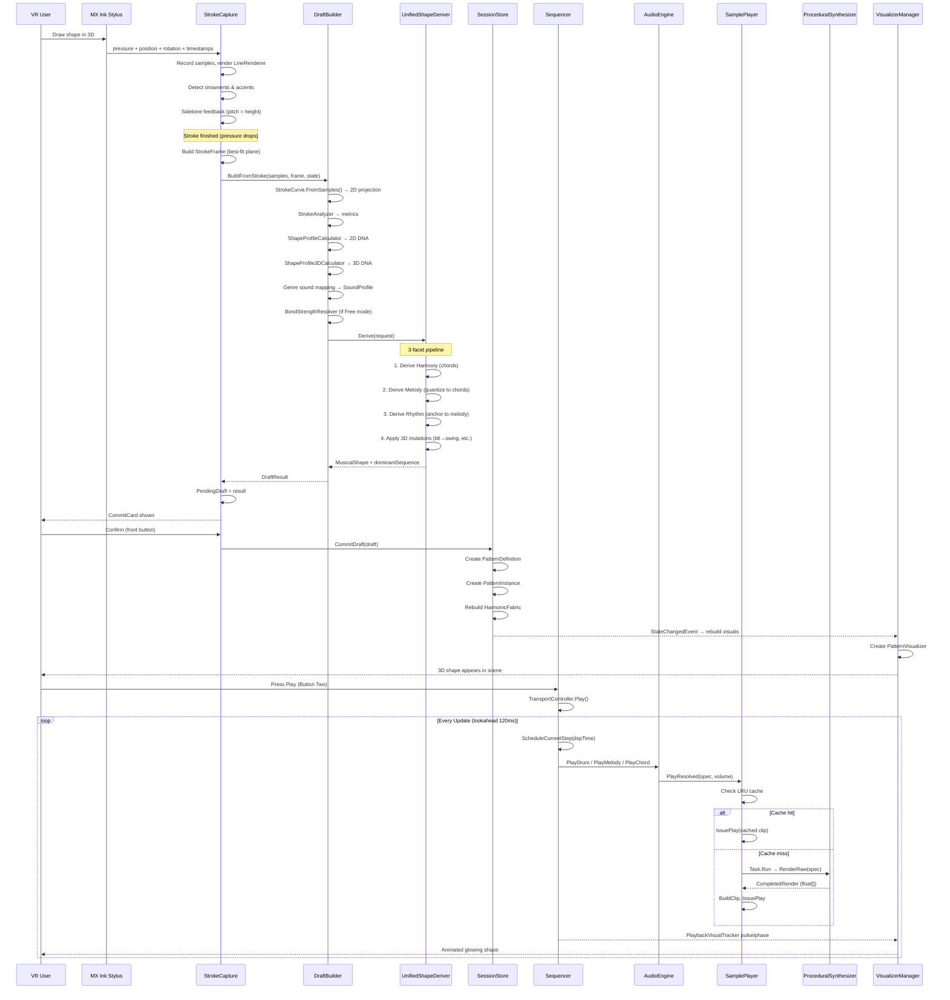
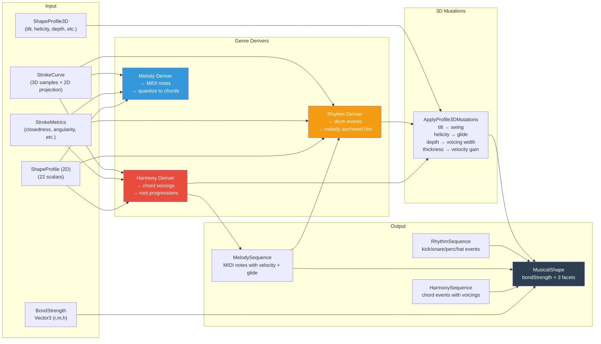
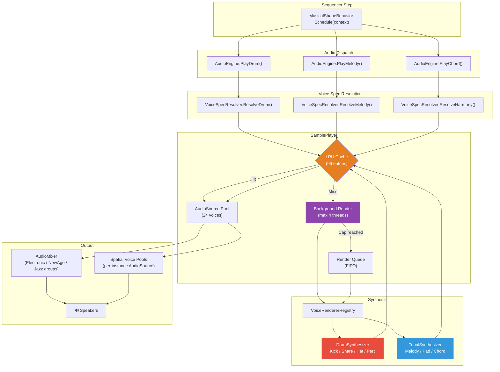
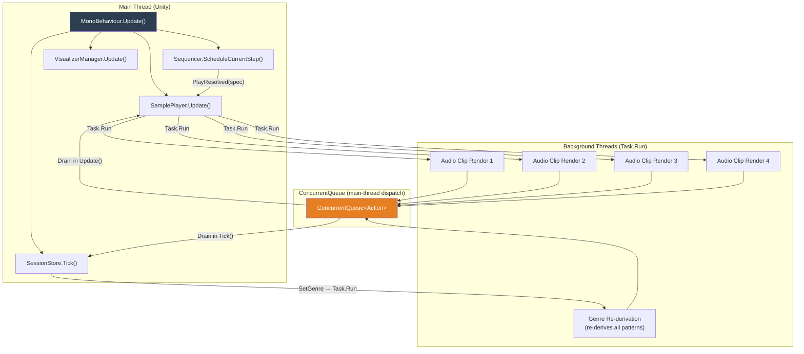

# RhythmForgeVR — Architecture Deep Dive

> **Version:** Save-format v10 (Phase G complete)  
> **Date:** 2026-04-18  
> **Stack:** Unity 2022.3 · XR Interaction Toolkit 3.3.1 · OVR SDK · Logitech MX Ink SDK  
> **Target:** Meta Quest 3 + Logitech MX Ink stylus

---

## Table of Contents

1. [Executive Summary](#1-executive-summary)
2. [High-Level Architecture Diagram](#2-high-level-architecture-diagram)
3. [Layer 0 — Bootstrap & Composition Root](#3-layer-0--bootstrap--composition-root)
4. [Layer 1 — Interaction (Input → Stroke)](#4-layer-1--interaction-input--stroke)
5. [Layer 2 — Core Data Model](#5-layer-2--core-data-model)
6. [Layer 3 — Shape Analysis Pipeline](#6-layer-3--shape-analysis-pipeline)
7. [Layer 4 — Musical Sequencing Engine](#7-layer-4--musical-sequencing-engine)
8. [Layer 5 — Genre System](#8-layer-5--genre-system)
9. [Layer 6 — Audio Engine & Synthesis](#9-layer-6--audio-engine--synthesis)
10. [Layer 7 — Sequencer & Transport](#10-layer-7--sequencer--transport)
11. [Layer 8 — Session State Management](#11-layer-8--session-state-management)
12. [Layer 9 — Event Bus](#12-layer-9--event-bus)
13. [Layer 10 — Visualization](#13-layer-10--visualization)
14. [Layer 11 — UI Panels (VR World-Space)](#14-layer-11--ui-panels-vr-world-space)
15. [Layer 12 — Spatial Zones](#15-layer-12--spatial-zones)
16. [Layer 13 — Persistence & Autosave](#16-layer-13--persistence--autosave)
17. [End-to-End Data Flow Diagram](#17-end-to-end-data-flow-diagram)
18. [Detailed Class Reference](#18-detailed-class-reference)
19. [Genre Derivation Pipeline Diagram](#19-genre-derivation-pipeline-diagram)
20. [Audio Rendering Pipeline Diagram](#20-audio-rendering-pipeline-diagram)
21. [Sequencer Scheduling Timeline](#21-sequencer-scheduling-timeline)
22. [Key Design Patterns](#22-key-design-patterns)
23. [Threading Model](#23-threading-model)
24. [Save Format & Migration](#24-save-format--migration)

---

## 1. Executive Summary

RhythmForgeVR is a **procedural music creation tool for VR**. The user draws shapes in 3D space with a pressure-sensitive stylus. Each drawn stroke is:

1. **Captured** as a 3D point cloud with pressure, rotation, and timestamps
2. **Analyzed** for geometric properties (circularity, angularity, symmetry, 3D tilt, helicity, etc.)
3. **Mapped** to musical parameters (rhythm density, melody contour, harmony voicing, timbre)
4. **Derived** into three simultaneous musical facets (rhythm, melody, harmony) governed by a **bond strength** vector
5. **Scheduled** by a lookahead sequencer and rendered as **procedural PCM audio** (no sample files)
6. **Visualized** as animated 3D shapes that pulse and glow during playback

The system supports three genres (Electronic, New Age, Jazz) that re-derive all existing patterns when switched — the same visual shapes produce entirely different music.

---

## 2. High-Level Architecture Diagram

```mermaid
graph TB
    subgraph "VR Hardware"
        STYLUS["Logitech MX Ink<br/>Stylus (pressure + tilt + buttons)"]
        HEAD["Meta Quest 3<br/>Head Tracking"]
    end

    subgraph "Layer 0: Bootstrap"
        BOOT["RhythmForgeBootstrapper<br/>Zero-config runtime builder"]
        VRLOC["VRRigLocator<br/>Finds OVRCameraRig"]
        UIFACT["UIFactory<br/>Programmatic VR canvas creation"]
        MATFACT["MaterialFactory<br/>Stroke & panel materials"]
    end

    subgraph "Layer 1: Interaction"
        INPUT["InputMapper<br/>Stylus → IInputProvider"]
        STROKECAP["StrokeCapture<br/>3D stroke recording + rendering"]
        DRAWMODE["DrawModeController<br/>Rhythm/Melody/Harmony/Free mode"]
        GRABBER["InstanceGrabber<br/>Ray-based grab + move"]
        UIPOINTER["StylusUIPointer<br/>VR canvas interaction"]
    end

    subgraph "Layer 2: Data Model"
        APPSTATE["AppState<br/>Root serializable state"]
        PATTERNDEF["PatternDefinition<br/>Committed musical pattern"]
        PATTERNINST["PatternInstance<br/>Placed instance in scene"]
        MUSICALSHAPE["MusicalShape<br/>Unified 3-facet shape"]
        SHAPEPROF["ShapeProfile (2D DNA)"]
        SHAPEPROF3D["ShapeProfile3D (3D DNA)"]
        SOUNPROF["SoundProfile (timbre params)"]
    end

    subgraph "Layer 3: Analysis"
        ANALYZER["StrokeAnalyzer<br/>2D geometric metrics"]
        CALC3D["ShapeProfile3DCalculator<br/>3D metrics (tilt, helicity, depth)"]
        CALCPROF["ShapeProfileCalculator<br/>2D shape DNA"]
        SOUNDMAP["SoundProfileMapper<br/>Shape → Sound mapping"]
    end

    subgraph "Layer 4: Sequencing"
        DRAFTBUILDER["DraftBuilder<br/>Stroke → DraftResult orchestrator"]
        UNIFIEDDERIVER["UnifiedShapeDeriverBase<br/>Harmony → Melody → Rhythm pipeline"]
        BONDRESOLVER["BondStrengthResolver<br/>Free-mode weight computation"]
        HARMFABRIC["HarmonicFabric<br/>Scene-wide chord progression"]
    end

    subgraph "Layer 5: Genre System"
        GENREREG["GenreRegistry<br/>Electronic / New Age / Jazz"]
        GENREPROF["GenreProfile<br/>Derivers + presets + mappings"]
        EDERIV["Electronic UnifiedShapeDeriver"]
        NDERIV["NewAge UnifiedShapeDeriver"]
        JDERIV["Jazz UnifiedShapeDeriver"]
    end

    subgraph "Layer 6: Audio"
        AUDIOENG["AudioEngine<br/>IAudioDispatcher implementation"]
        SAMPLEPLAY["SamplePlayer<br/>Thread-safe clip pool + LRU cache"]
        PROC_SYNTH["ProceduralSynthesizer<br/>PCM waveform generation"]
        DRUMSYNTH["DrumSynthesizer<br/>Kick/Snare/Hat/Perc synthesis"]
        TONALSYNTH["TonalSynthesizer<br/>Melody/Pad/Harmony synthesis"]
        VOICESPEC["VoiceSpecResolver<br/>Shape → Synth parameter resolution"]
        VOICEREG["VoiceRendererRegistry<br/>Spec → Renderer dispatch"]
        INSTVOICE["InstanceVoiceRegistry<br/>Spatial voice pools"]
    end

    subgraph "Layer 7: Sequencer"
        SEQUENCER["Sequencer<br/>Lookahead scheduler (120ms)"]
        TRANSPORT["TransportController<br/>Play/Stop/Advance"]
        ARRNAV["ArrangementNavigator<br/>8-slot linear arrangement"]
        SEQCLK["SequencerClock<br/>BPM → step duration"]
        PBTRACKER["PlaybackVisualTracker<br/>Pulse & phase for visuals"]
    end

    subgraph "Layer 8: State"
        STORE["SessionStore<br/>Central state store (Redux-like)"]
        PATREPO["PatternRepository<br/>Pattern CRUD"]
        SCENECTL["SceneController<br/>Scene switching & arrangement"]
        SOUNDRES["SoundProfileResolver<br/>Preset override resolution"]
    end

    subgraph "Layer 9: Events"
        EVENTBUS["RhythmForgeEventBus<br/>Type-safe pub/sub"]
    end

    subgraph "Layer 10: Visualization"
        VISMAN["VisualizerManager<br/>Instance visual lifecycle"]
        PATTERNVIS["PatternVisualizer<br/>3D shape rendering + animation"]
        PBANIM["PlaybackAnimator<br/>Pulse/halo/marker animation"]
    end

    subgraph "Layer 11: UI Panels"
        COMMIT["CommitCardPanel<br/>Save/Discard draft"]
        INSPECTOR["InspectorPanel<br/>Pattern details + controls"]
        DOCK["DockPanel<br/>Instruments/Patterns/Scenes browser"]
        TRANSPORTPNL["TransportPanel<br/>Play/Stop/BPM/Key/Mode"]
        SCENESTRP["SceneStripPanel<br/>Scene A/B/C/D selector"]
        ARRANGEMENT["ArrangementPanel<br/>8-slot arrangement editor"]
        GENRESEL["GenreSelectorPanel<br/>Electronic/NewAge/Jazz"]
        TOAST["ToastMessage<br/>Transient notifications"]
    end

    subgraph "Layer 12: Spatial"
        ZONECTL["SpatialZoneController<br/>Placement + audio bias zones"]
    end

    subgraph "Layer 13: Persistence"
        PERSIST["SessionPersistence<br/>JSON save/load"]
        AUTOSAVE["AutosaveController<br/>Timed autosave"]
        MIGRATOR["StateMigrator<br/>Version migration"]
    end

    subgraph "Orchestrator"
        MANAGER["RhythmForgeManager<br/>Top-level lifecycle & wiring"]
    end

    %% Hardware → Interaction
    STYLUS --> INPUT
    HEAD --> VRLOC
    INPUT --> STROKECAP
    INPUT --> GRABBER
    INPUT --> UIPOINTER
    DRAWMODE --> STROKECAP

    %% Bootstrap → Everything
    BOOT --> VRLOC
    BOOT --> UIFACT
    BOOT --> MATFACT
    BOOT --> MANAGER

    %% Interaction → Analysis
    STROKECAP --> DRAFTBUILDER
    DRAFTBUILDER --> ANALYZER
    DRAFTBUILDER --> CALC3D
    DRAFTBUILDER --> CALCPROF
    ANALYZER --> SOUNDMAP

    %% Analysis → Sequencing
    SOUNDMAP --> UNIFIEDDERIVER
    BONDRESOLVER --> UNIFIEDDERIVER
    HARMFABRIC --> UNIFIEDDERIVER
    UNIFIEDDERIVER --> DRAFTBUILDER

    %% Genre → Sequencing
    GENREREG --> GENREPROF
    GENREPROF --> EDERIV
    GENREPROF --> NDERIV
    GENREPROF --> JDERIV
    EDERIV --> UNIFIEDDERIVER
    NDERIV --> UNIFIEDDERIVER
    JDERIV --> UNIFIEDDERIVER

    %% State
    STORE --> PATREPO
    STORE --> SCENECTL
    STORE --> SOUNDRES
    STORE --> APPSTATE
    STORE --> HARMFABRIC
    APPSTATE --> PATTERNDEF
    APPSTATE --> PATTERNINST
    PATTERNDEF --> MUSICALSHAPE
    MUSICALSHAPE --> SHAPEPROF
    MUSICALSHAPE --> SHAPEPROF3D
    PATTERNDEF --> SOUNPROF

    %% Sequencer → Audio
    SEQUENCER --> TRANSPORT
    SEQUENCER --> ARRNAV
    SEQUENCER --> SEQCLK
    SEQUENCER --> AUDIOENG
    AUDIOENG --> SAMPLEPLAY
    AUDIOENG --> VOICESPEC
    AUDIOENG --> INSTVOICE
    SAMPLEPLAY --> PROC_SYNTH
    PROC_SYNTH --> DRUMSYNTH
    PROC_SYNTH --> TONALSYNTH
    VOICESPEC --> VOICEREG
    VOICEREG --> DRUMSYNTH
    VOICEREG --> TONALSYNTH

    %% Events
    STORE --> EVENTBUS
    MANAGER --> EVENTBUS
    SEQUENCER --> EVENTBUS

    %% Visualization
    MANAGER --> VISMAN
    VISMAN --> PATTERNVIS
    PATTERNVIS --> PBANIM
    SEQUENCER --> PBTRACKER
    PBTRACKER --> PATTERNVIS

    %% Persistence
    STORE --> PERSIST
    MANAGER --> AUTOSAVE
    PERSIST --> MIGRATOR

    %% Manager wiring
    MANAGER --> STORE
    MANAGER --> SEQUENCER
    MANAGER --> AUDIOENG
    MANAGER --> VISMAN
    MANAGER --> COMMIT
    MANAGER --> INSPECTOR
    MANAGER --> DOCK
    MANAGER --> TRANSPORTPNL
    MANAGER --> SCENESTRP
    MANAGER --> ARRANGEMENT
    MANAGER --> GENRESEL
    MANAGER --> TOAST
    MANAGER --> ZONECTL

    style BOOT fill:#e74c3c,color:#fff
    style MANAGER fill:#2c3e50,color:#fff
    style STORE fill:#27ae60,color:#fff
    style SEQUENCER fill:#8e44ad,color:#fff
    style AUDIOENG fill:#e67e22,color:#fff
    style STROKECAP fill:#3498db,color:#fff
```



---

## 3. Layer 0 — Bootstrap & Composition Root

### RhythmForgeBootstrapper

**File:** `Assets/RhythmForge/Bootstrap/RhythmForgeBootstrapper.cs`

The single entry point. Place one instance on a GameObject, press Play — it builds the entire application. Executed at `DefaultExecutionOrder(-100)` to run before everything else.

**Responsibilities:**
- Locates the OVRCameraRig and MX Ink StylusHandler via `VRRigLocator.Find()`
- Creates all subsystem GameObjects programmatically: `AudioEngine`, `SamplePlayer`, `InputMapper`, `DrawModeController`, `StrokeCapture`, `InstanceGrabber`, `Sequencer`, `SpatialZoneController`
- Builds **8 VR world-space UI panels** as `Canvas` objects with `UIFactory`
- Wires subsystem references into `RhythmForgeManager.Configure()`
- Positions all panels in front of the user's head after tracking stabilizes (~0.5s)
- Creates an `EventSystem` with `InputSystemUIInputModule`
- Disables conflicting Logitech sample `LineDrawing` component
- Suppresses `VrStylusHandler` in Unity Editor (prevents action-binding error floods)
- Loads a demo session on start (legacy 3-pattern or unified single-shape)

### VRRigLocator

**File:** `Assets/RhythmForge/Bootstrap/VRRigLocator.cs`

Finds `OVRCameraRig` in the scene and exposes:
- `CenterEye` — user's head transform
- `LeftController` / `RightController` — hand transforms
- `TrackingSpace` — tracking origin transform

### UIFactory

**File:** `Assets/RhythmForge/Bootstrap/UIFactory.cs`

Static helper that programmatically creates Unity UI elements for VR world-space canvases:
- `CreateWorldCanvas()` — creates a `Canvas` in WorldSpace render mode with a `CanvasScaler`
- `CreateButton()`, `CreateSlider()`, `CreateDropdown()` — standard UI widgets
- `CreateScrollView()` — scrollable list container
- `CreateBackground()` — semi-transparent panel background
- `CreateCenteredText()`, `CreateRectText()`, `CreateImage()` — text and image primitives

### MaterialFactory

**File:** `Assets/RhythmForge/Bootstrap/MaterialFactory.cs`

Creates runtime `Material` instances:
- `CreateStrokeMaterial(PatternType)` — per-type colored stroke material
- `PanelBg`, `ButtonDefault`, `ButtonActive`, `ButtonDanger` — UI panel materials

### RhythmForgeManager

**File:** `Assets/RhythmForge/RhythmForgeManager.cs`

The top-level orchestrator (not the bootstrapper itself). Receives all subsystem and panel references via `Configure(ManagerSubsystems, ManagerPanels, ...)`. Manages:

- Subsystem initialization order
- Event bus subscriptions (8 event types)
- Scene switching via thumbstick
- Play/stop via Button Two
- Genre change handling (invalidates audio cache, resets sequencer)
- Demo session loading
- Autosave orchestration
- Visualizer lifecycle

---

## 4. Layer 1 — Interaction (Input → Stroke)

### InputMapper → IInputProvider

**File:** `Assets/RhythmForge/Interaction/InputMapper.cs`

Bridges the Logitech `StylusHandler` to a generic `IInputProvider` interface. Exposes:
- `DrawPressure` — front tip pressure (0–1)
- `MiddlePressure` — middle barrel pressure (0–1, used for ornament detection)
- `StylusPose` — current stylus position + rotation
- `FrontButtonDown`, `BackButtonDown`, `BackDoubleTap` — button events
- `BackButton` — sustained back-button state
- `ButtonTwo` — controller face button (play/stop)
- `ButtonTwoLongPress` — long press (re-centre panels + zones)
- `LeftThumbstick` — thumbstick axis (scene switching)
- `FrontButtonConsumed` — prevents double-confirming drafts

### StrokeCapture

**File:** `Assets/RhythmForge/Interaction/StrokeCapture.cs`

The core input handler. Captures 3D stylus strokes in VR space:

**Per-frame capture:**
- Records `worldPos`, `pressure`, `stylusRot`, `timestamp` per sample
- Minimum point distance filter (`_minPointDistance = 0.002m`)
- Renders via `LineRenderer` with:
  - **Pressure-mapped width** (thin = soft, thick = loud)
  - **Tilt-mapped color** (upright = cyan, tilted = orange)
  - Per-vertex width animation curve
  - Per-vertex color gradient

**Expression detection:**
- **Ornament flag**: middle pressure ≥ 0.3 held for ≥ 0.12s → triggers ghost notes and passing tones
- **Accent flag**: back button held + short duration (≤ 0.45s) + short length (≤ 0.3m) → triggers accented re-triggers

**Sidetone feedback:**
- Generates a 220Hz triangle wave `AudioClip` at runtime
- Volume maps to pressure
- Pitch maps to stylus height relative to user's head (higher = higher pitch)

**Stroke completion flow:**
1. Stroke finishes (pressure drops below 0.05)
2. Rejects if fewer than 3 points
3. Computes stroke center (centroid of all world points)
4. Builds a `StrokeFrame` (best-fit plane via PCA of extremal points)
5. Constructs `StrokeCurve.FromSamples()` with 3D samples + plane basis
6. Calls `DraftBuilder.BuildFromStroke()` → returns `DraftResult`
7. Sets `PendingDraft` and fires `DraftCreatedEvent`
8. User sees `CommitCardPanel` for Save/Discard

**Draft confirmation:**
- `ConfirmDraft(false)` — save the draft
- `ConfirmDraft(true)` — save + immediately duplicate
- `DiscardPending()` — throw away
- Front button confirms, back button discards

### DrawModeController

**File:** `Assets/RhythmForge/Interaction/DrawModeController.cs`

Manages the current drawing mode:
- **PatternType**: `RhythmLoop`, `MelodyLine`, `HarmonyPad`
- **ShapeFacetMode**: `Free` (bonded three-facet), `SoloRhythm`, `SoloMelody`, `SoloHarmony`
- Controls the **bond strength** vector: `(rhythm, melody, harmony)` weights
- In Free mode, `bondStrength` is derived from shape properties by `BondStrengthResolver`
- In Solo modes, `bondStrength` is one-hot (e.g., `(1, 0, 0)` for SoloRhythm)

### InstanceGrabber

**File:** `Assets/RhythmForge/Interaction/InstanceGrabber.cs`

Ray-based grab interaction for moving committed pattern instances:
- Casts a ray from left controller
- Renders a thin blue `LineRenderer` ray
- On grab, moves the instance to the ray endpoint
- Recalculates spatial mix parameters (`brightness`, `reverbSend`, `delaySend`, `gainTrim`) from the new position

### StylusUIPointer

**File:** `Assets/RhythmForge/Interaction/StylusUIPointer.cs`

Enables stylus-based VR UI interaction:
- Casts a ray against layer 5 (UI)
- Renders a yellow `LineRenderer` when hovering
- Suppresses stroke drawing when hovering UI (`IsHoveringUI` flag)

---

## 5. Layer 2 — Core Data Model

### AppState

**File:** `Assets/RhythmForge/Core/Data/AppState.cs`

The root serializable state object:

| Field | Type | Description |
|-------|------|-------------|
| `version` | `int` | Save format version (current: 10) |
| `tempo` | `float` | BPM (60–160, default 85) |
| `key` | `string` | Musical key (e.g. "A minor") |
| `activeGenreId` | `string` | Active genre ("electronic", "newage", "jazz") |
| `drawMode` | `string` | Current PatternType as string |
| `drawShapeMode` | `string` | Current ShapeFacetMode as string |
| `activeSceneId` | `string` | Currently visible scene |
| `queuedSceneId` | `string` | Scene queued for next bar boundary |
| `selectedInstanceId` | `string` | Inspector selection |
| `harmonicContext` | `HarmonicContext` | Shared chord state |
| `patterns` | `List<PatternDefinition>` | All committed patterns |
| `instances` | `List<PatternInstance>` | All placed instances |
| `scenes` | `List<SceneData>` | 4 scenes (A/B/C/D) |
| `arrangement` | `List<ArrangementSlot>` | 8 arrangement slots |
| `counters` | `DraftCounters` | Auto-naming counters |

### PatternDefinition

**File:** `Assets/RhythmForge/Core/Data/PatternDefinition.cs`

A committed musical pattern — the reusable blueprint:

| Field | Description |
|-------|-------------|
| `id` | Unique 12-char hex ID |
| `type` | `PatternType` (RhythmLoop/MelodyLine/HarmonyPad) |
| `name` | Auto-generated name (e.g. "Beat-01", "Melody-03") |
| `bars` | Loop length in bars |
| `points` | Normalized 2D stroke points (0–1 range) |
| `worldPoints` | Center-relative 3D stroke points (v8+, nullable) |
| `renderRotation` | Quaternion for visualizer orientation |
| `derivedSequence` | Legacy single-facet derived data |
| `shapeProfile` | 2D geometric fingerprint (Shape DNA) |
| `shapeProfile3D` | 3D geometric fingerprint |
| `musicalShape` | Unified 3-facet shape (nullable for legacy saves) |
| `soundProfile` | Timbre parameters |
| `color` | Display color (blended for bonded shapes) |
| `genreId` | Genre that derived this pattern |
| `presetId` | Instrument preset ID |
| `tags`, `summary`, `details` | Human-readable metadata |

### PatternInstance

**File:** `Assets/RhythmForge/Core/Data/PatternInstance.cs`

A placed instance of a pattern in a scene:

| Field | Description |
|-------|-------------|
| `patternId` | Reference to parent `PatternDefinition` |
| `sceneId` | Which scene this instance belongs to |
| `position` | 3D world position |
| `depth` | Depth parameter (0–1) |
| `muted` | Mute toggle |
| `presetOverrideId` | Per-instance instrument preset override |
| `ensembleRoleIndex` | Position in the scene's ensemble (0 = primary) |
| `progressionBarIndex` | Position in the harmonic progression |
| Mix parameters | `brightness`, `reverbSend`, `delaySend`, `gainTrim` — auto-calculated from position |

**Spatial mix logic** (`RecalculateMixFromPosition()`):
- `brightness` = 1 − Y position (high = dark, low = bright)
- `reverbSend` = depth × 0.55 (far = more reverb)
- `delaySend` = depth × 0.35
- `gainTrim` = 1.05 − depth × 0.15

### MusicalShape

**File:** `Assets/RhythmForge/Core/Data/MusicalShape.cs`

The unified shape entity that bundles all three musical facets:

| Field | Description |
|-------|-------------|
| `bondStrength` | `Vector3` (rhythm, melody, harmony weights) |
| `facetMode` | `ShapeFacetMode` (Free/SoloRhythm/etc.) |
| `facets` | `DerivedShapeSequence` (rhythm + melody + harmony sequences) |
| `profile3D` | 3D shape profile |
| `totalSteps` | Loop length in sequencer steps |
| `bars` | Loop length in bars |
| Per-facet preset IDs | `rhythmPresetId`, `melodyPresetId`, `harmonyPresetId` |
| Per-facet sound profiles | `rhythmSoundProfile`, `melodySoundProfile`, `harmonySoundProfile` |

### ShapeProfile (2D)

**File:** `Assets/RhythmForge/Core/Data/ShapeProfile.cs`

22 scalar metrics describing a 2D stroke's geometry:

- **Geometry**: `closedness`, `circularity`, `aspectRatio`, `angularity`, `symmetry`
- **Extent**: `verticalSpan`, `horizontalSpan`, `worldWidth`, `worldHeight`, `worldLength`
- **Dynamics**: `speedVariance`, `curvatureMean`, `curvatureVariance`
- **Orientation**: `centroidHeight`, `directionBias`, `tilt`, `tiltSigned`, `wobble`
- **Scale**: `worldAverageSize`, `worldMaxDimension`, `pathLength`

### ShapeProfile3D

**File:** `Assets/RhythmForge/Core/Data/ShapeProfile3D.cs`

3D-specific metrics:

- `tiltMean`, `tiltVariance` — stylus tilt angle
- `thicknessMean`, `thicknessVariance` — pressure-derived thickness
- `depthSpan` — out-of-plane extent
- `planarity` — how flat the stroke is (1 = perfectly flat)
- `helicity` — spiral/corkscrew tendency
- `elongation3D` — 3D elongation ratio
- `temporalEvenness` — timing regularity
- `ornamentFlag`, `accentFlag` — expression flags from 3D gesture

### SoundProfile

**File:** `Assets/RhythmForge/Core/Data/SoundProfile.cs`

15 timbre parameters controlling the procedural synthesizer:

`brightness`, `resonance`, `drive`, `attackBias`, `releaseBias`, `detune`, `modDepth`, `stereoSpread`, `grooveInstability`, `delayBias`, `reverbBias`, `waveMorph`, `filterMotion`, `transientSharpness`, `body`

### DerivedShapeSequence

**File:** `Assets/RhythmForge/Core/Data/DerivedShapeSequence.cs`

Three parallel sequences:

- `RhythmSequence` — `List<RhythmEvent>` with `step`, `lane` (kick/snare/perc/hat), `velocity`, `microShift`
- `MelodySequence` — `List<MelodyNote>` with `step`, `midi`, `durationSteps`, `velocity`, `glide`
- `HarmonySequence` — `List<HarmonyEvent>` with `step`, `durationSteps`, `rootMidi`, `chord` (list of MIDI notes), `flavor`

---

## 6. Layer 3 — Shape Analysis Pipeline

### StrokeCurve

**File:** `Assets/RhythmForge/Core/Sequencing/StrokeCurve.cs`

The Phase G carrier struct. The single input every sub-deriver receives:

| Field | Description |
|-------|-------------|
| `samples` | Raw 3D `StrokeSample` list (worldPos + pressure + rotation + timestamp) |
| `projected` | 2D projection onto the stroke's best-fit plane |
| `planeCenter` | 3D center of the stroke |
| `planeRight` | First basis vector of the stroke plane |
| `planeUp` | Second basis vector of the stroke plane |

Two construction paths:
- `FromSamples()` — fresh draft: 3D samples + plane basis → projects to 2D via dot products
- `FromLegacy2D()` — rederivation from v7 saves: wraps existing 2D points (no 3D samples)

### StrokeAnalyzer

**File:** `Assets/RhythmForge/Core/Analysis/StrokeAnalyzer.cs`

Computes `StrokeMetrics` from a 2D point list:
- **Closedness**: distance between first and last point, normalized
- **Circularity**: ratio of area to perimeter²
- **Symmetry**: cross-correlation of halves
- **Angularity**: cumulative angle change
- **Aspect ratio**: bounding box proportions
- **Centroid height**: vertical center
- **Path length**: total arc length

Also provides `NormalizePoints()` which fits points into a 0–1 bounding box.

### ShapeProfileCalculator

**File:** `Assets/RhythmForge/Core/Analysis/ShapeProfileCalculator.cs`

Converts `StrokeMetrics` + normalized points into a `ShapeProfile` (22 scalars). Adds world-space measurements.

### ShapeProfile3DCalculator

**File:** `Assets/RhythmForge/Core/Analysis/ShapeProfile3DCalculator.cs`

Computes `ShapeProfile3D` from raw 3D `StrokeSample` list:
- Fits a stroke plane via SVD
- Measures out-of-plane deviation → `depthSpan`, `planarity`
- Computes pressure statistics → `thicknessMean`, `thicknessVariance`
- Computes stylus tilt → `tiltMean`, `tiltVariance`
- Detects spiral patterns → `helicity`
- Measures timing regularity → `temporalEvenness`
- Carries through expression flags → `ornamentFlag`, `accentFlag`

### SoundProfileMapper

**File:** `Assets/RhythmForge/Core/Analysis/SoundProfileMapper.cs`

Maps a `ShapeProfile` to a `SoundProfile` using genre-specific `PatternSoundMappingProfile` weights. Each of the 15 sound parameters is computed as a weighted sum of shape metrics.

### PresetBiasResolver

**File:** `Assets/RhythmForge/Core/Analysis/PresetBiasResolver.cs`

Selects the best `InstrumentPreset` based on shape properties, and generates the `shapeSummary` string (the "Shape DNA" description).

---

## 7. Layer 4 — Musical Sequencing Engine

### DraftBuilder

**File:** `Assets/RhythmForge/Core/Session/DraftBuilder.cs`

Orchestrates the stroke → music pipeline:

1. Receives raw 3D samples + stroke frame from `StrokeCapture`
2. Constructs `StrokeCurve` (3D → 2D projection)
3. Computes `StrokeMetrics` via `StrokeAnalyzer`
4. Computes `ShapeProfile` via `ShapeProfileCalculator`
5. Computes `ShapeProfile3D` via `ShapeProfile3DCalculator`
6. Derives `SoundProfile` via genre mapping
7. Resolves `ShapeFacetMode` and `bondStrength`
8. Per-facet sound profile computation (each facet gets its own mapping)
9. Builds `UnifiedDerivationRequest`
10. Calls `genre.UnifiedDeriver.Derive(request)`
11. Returns `DraftResult` with all musical data

### UnifiedShapeDeriverBase

**File:** `Assets/RhythmForge/Core/Sequencing/UnifiedShapeDeriverBase.cs`

The core 3-facet derivation pipeline. Executes in strict order:

1. **Resolve bond strength** — if Free mode, compute from `ShapeProfile` + `ShapeProfile3D` via `BondStrengthResolver`
2. **Derive Harmony first** — generates chord voicings and root progressions
   - Uses `PatternContextScope` for role-awareness
   - Writes chords into `HarmonicFabric`
3. **Derive Melody** — quantizes to harmony chord tones on strong beats
   - Reads the harmony chord at each bar via `barChordProvider`
   - Stays in key via `MusicalKeys.QuantizeToKey()`
4. **Derive Rhythm** — generates drum patterns
   - Adds **melody-anchored** percussion hits (kick/perc on melody note positions)
5. **Apply 3D profile mutations**:
   - Tilt + thickness variance → rhythm velocity accent gain, swing offset
   - Elongation → melody gain and duration scaling
   - Helicity → glide amount
   - Depth span → chord voicing widening
   - Temporal evenness → micro-shift scaling
6. Build the unified `MusicalShape` with all three `DerivedShapeSequence` facets
7. Extract the dominant facet as `dominantSequence` for the legacy `PatternDefinition`

### BondStrengthResolver

**File:** `Assets/RhythmForge/Core/Sequencing/BondStrengthResolver.cs`

Computes Free-mode bond strength from shape properties:

| Facet | Signals |
|-------|---------|
| **Rhythm** | `angularity + thicknessVariance + (1 − planarity)` |
| **Melody** | `elongation3D + (1 − circularity) + pathLength` |
| **Harmony** | `circularity + closedness + depthSpan + planarity` |

Each component is soft-normalized and clamped to `[0.15, 0.85]` so no facet is ever silent in Free mode. Final L1 normalization ensures weights sum to 1.

### HarmonicFabric

**File:** `Assets/RhythmForge/Core/Sequencing/HarmonicFabric.cs`

Scene-wide chord-per-bar scaffold:

- `progression` — list of `ChordPlacement` slots (one per bar)
- `Write(bar, rootMidi, chord, flavor)` — writes a chord to a bar slot
- `ChordAtBar(bar)` — reads the chord, wrapping via modulo
- First harmony shape writes the chord; subsequent melody shapes quantize to it
- Maintained per-scene by `SessionStore`
- Rebuilt when genre changes or patterns are added/removed

### PatternContextScope

**File:** `Assets/RhythmForge/Core/Sequencing/PatternContextScope.cs`

Thread-local scope that provides role context during derivation:
- `ShapeRole` — `(index, count)` pair indicating which shape in the ensemble
- `HarmonicContext` — current chord tones for quantization
- Supports nesting via `Push()` / `Dispose()`

### StrokeResampler

**File:** `Assets/RhythmForge/Core/Sequencing/StrokeResampler.cs`

Resamples stroke curves at uniform arc-length intervals for consistent derivation.

---

## 8. Layer 5 — Genre System

### GenreRegistry

**File:** `Assets/RhythmForge/Core/Data/GenreRegistry.cs`

Static registry holding three `GenreProfile` instances:

| Genre | ID | Default Tempo | Default Key | Description |
|-------|----|--------------|-------------|-------------|
| Electronic | `electronic` | 85 BPM | A minor | Lo-Fi, Trap & Dream synthesis |
| New Age | `newage` | 68 BPM | C major | Meditative bowls, kalimba & drones |
| Jazz | `jazz` | 110 BPM | D minor | Brush kit, Rhodes & jazz voicings |

### GenreProfile

**File:** `Assets/RhythmForge/Core/Data/GenreProfile.cs`

Complete genre definition:

| Component | Description |
|-----------|-------------|
| `InstrumentPreset` list | Available voices (9 for Electronic, 3 each for New Age/Jazz) |
| Default preset IDs | Maps `PatternType` → default preset |
| `PatternSoundMappingProfile` | Per-type metric → sound parameter weights |
| `IRhythmDeriver` | Rhythm pattern generation |
| `IMelodyDeriver` | Melody note generation |
| `IHarmonyDeriver` | Chord voicing generation |
| `IUnifiedShapeDeriver` | Composes all three into a `MusicalShape` |
| `GroupBusFx` | Default reverb/delay send levels |
| `PatternColorPalette` | Per-type colors |

### Genre-Specific Derivers

Each genre has its own `Rhythm/`, `Melody/`, `Harmony/` deriver pair:

- **Electronic**: `ElectronicRhythmDeriver` (lo-fi/trap patterns), `ElectronicMelodyDeriver` (pentatonic contours), `ElectronicHarmonyDeriver` (minor 7th/9th voicings)
- **New Age**: `NewAgeRhythmDeriver` (sparse, bowl-like), `NewAgeMelodyDeriver` (kalimba arpeggios), `NewAgeHarmonyDeriver` (drone + open fifths)
- **Jazz**: `JazzRhythmDeriver` (brush patterns with swing), `JazzMelodyDeriver` (chromatic approach notes), `JazzHarmonyDeriver` (extended voicings, rootless chords)

Each genre also has a genre-specific `UnifiedShapeDeriver` that customises the harmony → melody → rhythm pipeline (e.g., Jazz adds more swing, New Age uses longer pads).

---

## 9. Layer 6 — Audio Engine & Synthesis

### AudioEngine

**File:** `Assets/RhythmForge/Audio/AudioEngine.cs`

Central audio dispatcher implementing `IAudioDispatcher`:

| Method | Facet | Route |
|--------|-------|-------|
| `PlayDrum(preset, lane, velocity, ...)` | Rhythm | → `SamplePlayer.PlayResolved()` |
| `PlayMelody(preset, midi, velocity, duration, ...)` | Melody | → `SamplePlayer.PlayResolved()` |
| `PlayChord(preset, chord, velocity, duration, ...)` | Harmony | → `PlayMelody()` per chord tone |

Key features:
- **Spatial routing**: instances with registered voice pools get spatial `AudioSource`s
- **Zone bias**: applies per-zone reverb/delay/gain overrides from `SpatialZoneController`
- **Velocity shaping**: gain formula = `gainTrim × velocity² × (0.72 + body × factor)`
- **Genre routing**: `SetGenre()` re-routes pool sources to the genre's AudioMixer group

### SamplePlayer

**File:** `Assets/RhythmForge/Audio/SamplePlayer.cs`

Thread-safe procedural clip player with pooled AudioSources and LRU cache:

| Component | Detail |
|-----------|--------|
| Pool size | 24 `AudioSource` instances, round-robin |
| Cache | LRU dictionary up to 96 `AudioClip` entries |
| Background rendering | Up to 4 concurrent `Task.Run` render threads |
| Render queue | FIFO queue for overflow when concurrency cap is reached |
| Generation counter | `InvalidateAll()` bumps generation; stale renders are discarded |
| Clip warming | `WarmClips()` pre-renders next bar's specs before the sequencer needs them |
| Pending plays | If a clip isn't ready when `PlayClip()` is called, the play is queued and issued when the background render completes |

### ProceduralSynthesizer

**File:** `Assets/RhythmForge/Audio/ProceduralSynthesizer.cs`

Facade over the synthesis pipeline. Generates all audio in code (44100 Hz):

### DrumSynthesizer

**File:** `Assets/RhythmForge/Audio/Synthesis/DrumSynthesizer.cs`

Generates percussion waveforms:
- **Kick**: sine sweep (150Hz → 40Hz) + distortion + envelope
- **Snare**: noise burst + body tone + band-pass filter
- **Hi-hat**: high-frequency noise + band-pass + short envelope
- **Perc**: filtered tone with configurable frequency

Parameters controlled by `ResolvedVoiceSpec`: `drive`, `brightness`, `body`, `attackBias`, `releaseBias`, `filterMotion`, `resonance`

### TonalSynthesizer

**File:** `Assets/RhythmForge/Audio/Synthesis/TonalSynthesizer.cs`

Generates melodic and harmonic waveforms:
- Dual oscillator: `waveA` + `waveB` (sine, triangle, square, sawtooth)
- Detune and stereo spread
- ADSR envelope with glide support
- Filter: LowPass / HighPass / BandPass with resonance and motion
- Per-voice effects: delay, reverb, chorus

### VoiceSpecResolver

**File:** `Assets/RhythmForge/Audio/VoiceSpec/VoiceSpecResolver.cs`

Transforms high-level musical parameters into `ResolvedVoiceSpec`:
- Quantizes parameters to discrete buckets (12-step for 0–1 values, 3-step for reverb, 4-step for delay)
- Resolves waveforms based on genre + voice type + shape metrics
- Sets attack/release times from preset envelopes + shape biases
- Applies per-mode gain offsets (harmony sits under melody under rhythm)
- Computes per-note MIDI frequency
- Sets chorus width scaling for non-primary roles

### VoiceRendererRegistry

**File:** `Assets/RhythmForge/Audio/Voices/VoiceRendererRegistry.cs`

Routes `ResolvedVoiceSpec` to the correct renderer:
- `ProceduralDrumRenderer` — handles `PatternType.RhythmLoop`
- `ProceduralTonalRenderer` — handles `MelodyLine` and `HarmonyPad`

### InstanceVoiceRegistry

**File:** `Assets/RhythmForge/Audio/InstanceVoiceRegistry.cs`

Maps pattern instance IDs to dedicated `InstanceVoicePool`s for spatial audio:
- Each pool owns 2–3 `AudioSource`s positioned at the instance's 3D location
- Enables 3D spatialization (distance attenuation, panning)
- Shared singleton via `GetShared()`

---

## 10. Layer 7 — Sequencer & Transport

### Sequencer

**File:** `Assets/RhythmForge/Sequencer/Sequencer.cs`

A **lookahead scheduler** that drives pattern playback:

```
Update() loop:
  while (nextNoteTime < dspTime + 0.12s):
    ScheduleCurrentStep(nextNoteTime)
    AdvanceTransport()
    nextNoteTime += stepDuration

  TryWarmNextBar()  // pre-render next bar's clips
```

**Two modes:**
- **Scene mode** — loops the active scene's instances
- **Arrangement mode** — sequences through up to 8 arrangement slots

**Per-step scheduling:**
1. Gets the playback scene ID
2. For each non-muted instance in the scene:
   - Looks up `PatternDefinition` and effective sound/preset
   - Computes `localStep = currentStep % totalSteps`
   - Routes to `PatternBehaviorRegistry.GetForPattern(pattern).Schedule(context)`
3. `MusicalShapeBehavior` fans out all three facets (rhythm/melody/harmony) based on `bondStrength`

**Clip warming:**
- At bar boundaries, collects all `ResolvedVoiceSpec`s for the next bar
- Calls `SamplePlayer.WarmClips()` to pre-render on background threads

### TransportController

**File:** `Assets/RhythmForge/Sequencer/TransportController.cs`

Manages transport state:

| State | Description |
|-------|-------------|
| `playing` | Is transport running |
| `mode` | "scene" or "arrangement" |
| `sceneStep` | Current step in scene mode |
| `slotIndex` | Current arrangement slot |
| `slotStep` | Step within current slot |
| `absoluteBar` | Monotonically increasing bar counter |
| `nextNoteTime` | Next DSP time to schedule |
| `playbackSceneId` | Scene currently playing back |

**Scene transitions:**
- If `queuedSceneId` is set, switches at the next bar boundary
- Fires `OnPlaybackSceneChanged` for visual cleanup

### ArrangementNavigator

**File:** `Assets/RhythmForge/Sequencer/ArrangementNavigator.cs`

Tracks position within the 8-slot arrangement:
- `FindFirstPopulatedSlot()` — starts playback
- `FindNextPopulatedSlot(current)` — advances to next populated slot
- Wraps around to the beginning for infinite looping

### SequencerClock

**File:** `Assets/RhythmForge/Sequencer/SequencerClock.cs`

Static utility: `StepDuration(tempo)` = `60.0 / (tempo * BarSteps / 4)` seconds per step.

### PlaybackVisualTracker

**File:** `Assets/RhythmForge/Sequencer/PlaybackVisualTracker.cs`

Tracks scheduled audio events and computes real-time visual state:
- `RecordTrigger(instanceId, scheduledTime, duration, ...)` — called when a note is scheduled
- `GetPulse(instanceId, time)` — returns 0–1 pulse intensity at the current time
- `GetPhaseForPattern()` — returns playback phase (0–1) for the visualizer
- Prunes expired events every frame

---

## 11. Layer 8 — Session State Management

### SessionStore

**File:** `Assets/RhythmForge/Core/Session/SessionStore.cs`

Central state store (Redux-like pattern):

**Core operations:**
- `LoadState(state)` — loads an `AppState`, migrates, rebuilds harmonic fabrics
- `Reset()` — creates empty state
- `Tick()` — drains the main-thread dispatch queue

**Pattern management (via PatternRepository):**
- `CommitDraft(draft, duplicate)` — commits a stroke as a new pattern + instance
- `SpawnPattern(patternId, sceneId, coords)` — places an existing pattern
- `ClonePattern(patternId)` — duplicates a pattern definition
- `RemoveInstance(instanceId)` — removes an instance
- `DuplicateInstance(instanceId)` — duplicates an instance

**Scene management (via SceneController):**
- `SetActiveScene(sceneId)` — switches active scene
- `QueueScene(sceneId)` — queues a scene switch for the next bar boundary
- `CopyScene(sourceId, targetId)` — copies all instances between scenes
- `UpdateArrangement(slotId, sceneId, bars)` — configures arrangement slots

**Genre management:**
- `SetGenre(genreId)` — switches genre and **re-derives all patterns on a background thread**
  1. Fires `GenreChangedEvent` immediately (UI updates)
  2. Snapshots all pattern data
  3. `Task.Run()` — re-analyzes and re-derives every pattern with the new genre's derivers
  4. Posts results to `ConcurrentQueue<Action>`
  5. `Tick()` drains queue on main thread, applies results, fires `OnGenreRederived`

**Harmonic context:**
- `GetHarmonicContext()` — returns the active scene's current chord
- `SetHarmonicContext(root, tones, flavor)` — updates the shared context
- `ReindexSceneEnsemble(sceneId)` — reassigns role indices after instance changes
- `RebuildAllSceneFabrics()` — rebuilds all scene chord progressions from harmony patterns

### PatternRepository

**File:** `Assets/RhythmForge/Core/Session/PatternRepository.cs`

CRUD operations on patterns and instances. Handles:
- Auto-naming (`ReserveName`)
- Spawn position resolution (via spatial zone controller)
- Instance position → mix parameter recalculation

### SceneController

**File:** `Assets/RhythmForge/Core/Session/SceneController.cs`

Scene switching, queueing, and arrangement management.

### SoundProfileResolver

**File:** `Assets/RhythmForge/Core/Session/SoundProfileResolver.cs`

Resolves the effective sound profile for an instance, considering preset overrides.

---

## 12. Layer 9 — Event Bus

### RhythmForgeEventBus

**File:** `Assets/RhythmForge/Core/Events/RhythmForgeEventBus.cs`

Type-safe pub/sub event system using generic `struct` events:

| Event | Payload | When Fired |
|-------|---------|------------|
| `SessionStateChangedEvent` | `SessionStore` | Any state mutation |
| `DraftCreatedEvent` | `DraftResult` | Stroke completed |
| `DraftCommittedEvent` | `DraftResult + PatternInstance + duplicate` | Draft saved |
| `DraftDiscardedEvent` | — | Draft discarded |
| `StrokeStartedEvent` | — | Stylus touches surface |
| `DrawModeChangedEvent` | `PatternType` | Mode button pressed |
| `DrawShapeModeChangedEvent` | `ShapeFacetMode` | Shape mode button pressed |
| `TransportChangedEvent` | `Transport + sceneId + isPlaying` | Play/stop/step advance |
| `PlaybackSceneChangedEvent` | `previousSceneId + currentSceneId` | Scene switch during playback |
| `ParameterLabelsVisibilityChangedEvent` | `visible` | Params toggle pressed |
| `GenreChangedEvent` | `previousGenreId + newGenreId` | Genre button pressed |

Subscribers: `RhythmForgeManager`, all UI panels, `VisualizerManager`, `Sequencer`.

---

## 13. Layer 10 — Visualization

### VisualizerManager

**File:** `Assets/RhythmForge/VisualizerManager.cs`

Manages the lifecycle of `PatternVisualizer` instances:

- `RebuildInstanceVisuals()` — syncs visualizers with the current scene's instances:
  - Creates new visualizers for new instances
  - Refreshes existing visualizers (geometry, color, parameters)
  - Destroys visualizers for removed instances
- `UpdatePlaybackVisuals()` — per-frame: queries sequencer for pulse/phase, updates animations
- `SetParameterLabelVisible()` — toggles parameter labels on all visualizers

### PatternVisualizer

**File:** `Assets/RhythmForge/UI/PatternVisualizer.cs`

Per-instance 3D visualization:
- Renders the stroke as a `LineRenderer` in world space
- Uses per-type materials (colored by `PatternType` or blended for bonded shapes)
- During playback:
  - **Pulse**: line width and glow scale with audio intensity
  - **Halo**: surrounding glow effect via `PlaybackHaloRenderer`
  - **Marker**: moving point along the stroke path
  - **Parameter labels**: floating text showing shape metrics

### PlaybackAnimator

**File:** `Assets/RhythmForge/UI/Rendering/PlaybackAnimator.cs`

Computes per-frame animation energies from `PatternPlaybackVisualState`:
- `lineEnergy` — stroke line width modulation
- `haloEnergy` — glow intensity
- `markerEnergy` — marker brightness
- `markerPhase` — position along the stroke (0–1)
- `markerScale` — marker size
- `normalOffset` — stroke plane offset for 3D depth
- `haloBreath` — slow breathing modulation

---

## 14. Layer 11 — UI Panels (VR World-Space)

All panels are built programmatically by `RhythmForgeBootstrapper` as world-space `Canvas` objects positioned in front of the user. They can be **dragged** via `PanelDragCoordinator` and **re-centred** with Button Two long-press.

| Panel | Position | Purpose |
|-------|----------|---------|
| **TransportPanel** | Center, eye level | Play/Stop, BPM display, key display, mode selector, shape mode, params toggle |
| **SceneStripPanel** | Below transport | Scene A/B/C/D buttons |
| **ArrangementPanel** | Below scene strip | 8 slots with scene assignment + bar count |
| **CommitCardPanel** | Center, slightly above | Draft preview: name, type, shape DNA, Save/Save+Dup/Discard |
| **InspectorPanel** | Right side | Selected pattern: type bar, metrics sliders, depth, mute/remove/duplicate, preset |
| **DockPanel** | Left side | Tabbed: Instruments list, Patterns list, Scenes list + draw mode label |
| **GenreSelectorPanel** | Far right, elevated | Three genre buttons with descriptions |
| **ToastMessage** | Top center | Transient notification with fade animation |

### PanelDragCoordinator

**File:** `Assets/RhythmForge/Interaction/PanelDragCoordinator.cs`

Manages drag interaction for all panels:
- Groups panels as "MainGroup" (move together) or "Independent"
- Stylus press + drag on a panel header moves it
- MainGroup panels maintain their relative positions

---

## 15. Layer 12 — Spatial Zones

### SpatialZoneController

**File:** `Assets/RhythmForge/Core/Session/SpatialZoneController.cs`

Manages spatial zones in the VR play space:

- **Default placement**: each `PatternType` gets a preferred zone (rhythm left, melody center, harmony right)
- **Audio bias**: zones apply reverb/delay/gain offsets to instances within them
- **Recentring**: long-press Button Two recentres all zones to the user's current forward direction
- Uses `SpatialZoneLayout` for configurable zone definitions

### SpatialZoneLayout

**File:** `Assets/RhythmForge/Core/Data/SpatialZoneLayout.cs`

Defines the spatial layout of zones:
- Default: 3 zones (Left, Center, Right) with different reverb/delay/gain biases
- Configurable per-zone parameters

---

## 16. Layer 13 — Persistence & Autosave

### SessionPersistence

**File:** `Assets/RhythmForge/Core/Session/SessionPersistence.cs`

JSON serialization of `AppState`:
- `Save(state)` — serializes to `PlayerPrefs` or file
- `Load()` — deserializes, returns `AppState` or null
- `Delete()` — clears saved state

### AutosaveController

**File:** `Assets/RhythmForge/AutosaveController.cs`

Timer-based autosave:
- `Tick(deltaTime, state)` — accumulates time, saves when interval reached
- `SaveNow(state)` — immediate save
- `ResetTimer()` — resets the timer (e.g., after manual save)

### StateMigrator

**File:** `Assets/RhythmForge/Core/Session/StateMigrator.cs`

Handles loading older save formats:
- `NormalizeState(state)` — ensures all required fields exist
- Migrates from version N to version 10
- Handles deprecated fields (`pan`, `gain` → `gainTrim`)

---

## 17. End-to-End Data Flow Diagram



---

## 18. Detailed Class Reference

### Pattern Behaviors

| Behavior | Facets | When Used |
|----------|--------|-----------|
| `MusicalShapeBehavior` | All three (bond strength) | `pattern.musicalShape != null` (v7+ saves) |
| `RhythmLoopBehavior` | Rhythm only | Legacy saves without `musicalShape` |
| `MelodyLineBehavior` | Melody only | Legacy saves without `musicalShape` |
| `HarmonyPadBehavior` | Harmony only | Legacy saves without `musicalShape` |

`PatternBehaviorRegistry.GetForPattern(pattern)` routes: if `musicalShape` exists → `MusicalShapeBehavior`, else → per-type behavior.

### MusicalShapeBehavior Scheduling

On each sequencer step, for each facet with `bondStrength > 0`:

| Facet | Audio Call | Velocity Scaling |
|-------|-----------|-----------------|
| Rhythm | `PlayDrum(preset, lane, velocity × bondStrength.x, ...)` | `0.4 + 0.6 × weight` |
| Melody | `PlayMelody(preset, midi, velocity × bondStrength.y, ...)` | `0.4 + 0.6 × weight` |
| Harmony | `PlayChord(preset, chord, baseVelocity × bondStrength.z, ...)` | `0.4 + 0.6 × weight` |

Plus expression layers:
- **Accent**: re-triggers at +1 step with 24–82% velocity
- **Ornament**: every 3rd rhythm hit at 42% velocity; passing tones between melody notes at 62%

### PatternSchedulingContext

Passed to every `IPatternBehavior.Schedule()` call:

```
PatternDefinition pattern
PatternInstance instance
int localStep           // current step within the pattern's loop
float stepDuration      // seconds per step
double scheduledTime    // DSP time to schedule at
SoundProfile sound
InstrumentPreset preset
InstrumentGroup group
Transport transport
AppState appState
IAudioDispatcher audioDispatcher
Action<string, double, float> recordTrigger   // for visual tracking
Func<string, InstrumentPreset> presetLookup   // for facet preset resolution
```

---

## 19. Genre Derivation Pipeline Diagram



---

## 20. Audio Rendering Pipeline Diagram



---

## 21. Sequencer Scheduling Timeline

```mermaid
gantt
    title Sequencer Lookahead Scheduling (120ms window)
    dateFormat X
    axisFormat %Lms

    section DSP Timeline
    Current Time (now) :milestone, 0, 0
    Step 5 scheduled    :active, 5, 8
    Step 6 scheduled    :active, 8, 11
    Step 7 scheduled    :active, 11, 14
    Lookahead boundary (now + 120ms) :milestone, 14, 14

    section Background
    Warm next bar clips :crit, 2, 12

    section Visual Update
    Pulse/Phase query   : 0, 14
```



---

## 22. Key Design Patterns

### Pattern 1: Zero-Config Bootstrap

`RhythmForgeBootstrapper` builds the entire application graph at runtime. No manual scene setup or Inspector wiring needed. All subsystems are created, configured, and connected in code.

### Pattern 2: Central State Store (Redux-like)

`SessionStore` is the single source of truth. All mutations go through the store, which fires `SessionStateChangedEvent` for UI and visualization updates.

### Pattern 3: Type-Safe Event Bus

`RhythmForgeEventBus` uses generic `struct` events for compile-time safety. No magic strings. Subscribers are auto-cleaned on `OnDestroy`.

### Pattern 4: Strategy Pattern — Genre Derivers

Each genre provides `IRhythmDeriver`, `IMelodyDeriver`, `IHarmonyDeriver`, and `IUnifiedShapeDeriver`. Switching genres swaps the strategy without changing the pipeline.

### Pattern 5: Strategy Pattern — Pattern Behaviors

`IPatternBehavior` implementations (`RhythmLoopBehavior`, `MelodyLineBehavior`, `HarmonyPadBehavior`, `MusicalShapeBehavior`) encapsulate scheduling logic. `PatternBehaviorRegistry` routes by pattern data.

### Pattern 6: Object Pool — Audio Voices

`SamplePlayer` maintains a pool of 24 `AudioSource` components with round-robin allocation. `InstanceVoiceRegistry` adds spatial pools per pattern instance.

### Pattern 7: LRU Cache — Audio Clips

`SamplePlayer` caches up to 96 `AudioClip` instances with LRU eviction. Clips not in use by playing sources are evicted first.

### Pattern 8: Background Thread Rendering

Audio clip synthesis runs on `Task.Run()` background threads (max 4 concurrent). Results are promoted to `AudioClip` on the main thread via `ConcurrentQueue`.

### Pattern 9: Lookahead Scheduling

The sequencer schedules notes 120ms ahead of current DSP time, ensuring glitch-free playback despite frame rate variations.

### Pattern 10: Bond Strength Vector

A single `Vector3` (rhythm, melody, harmony) controls the audible balance of each shape. Solo modes use one-hot vectors; Free mode derives from shape geometry.

---

## 23. Threading Model



**Rules:**
1. All `AudioClip` creation (`AudioClip.Create`, `SetData`) happens on the main thread
2. Raw PCM float arrays are computed on background threads
3. `SessionStore` mutations happen on the main thread only
4. Genre re-derivation reads pattern data (snapshot) on background, writes results on main thread
5. `ConcurrentQueue<Action>` bridges background → main thread

---

## 24. Save Format & Migration

### Save Format Version History

| Version | Changes |
|---------|---------|
| 1–6 | Legacy single-facet patterns (no `MusicalShape`) |
| 7 | Added `MusicalShape` with 3-facet `DerivedShapeSequence` |
| 8 | Added `worldPoints` (center-relative 3D stroke), `StrokeCurve` carrier |
| 9 | Per-facet preset IDs and sound profiles |
| 10 | Current: full `ShapeProfile3D`, expression flags, spatial zone state |

### Migration Strategy

`StateMigrator.NormalizeState()` ensures:
- All required fields have defaults
- Missing `scenes` → create 4 default scenes
- Missing `arrangement` → create 8 empty slots
- Missing `harmonicContext` → create default A minor
- Deprecated `pan`/`gain` fields → migrated to position-based mix
- Legacy single-facet patterns → preserved as-is (per-type behaviors still handle them)

### Backward Compatibility

- `PatternBehaviorRegistry.GetForPattern()` routes legacy patterns (no `musicalShape`) to their per-type behavior
- `StrokeCurve.FromLegacy2D()` wraps v7 saves for re-derivation
- `MusicalShapeBehavior` only activates when `musicalShape.facets != null`
- Audio output is **bit-identical** for legacy patterns regardless of code path

---

*End of Architecture Deep Dive*
